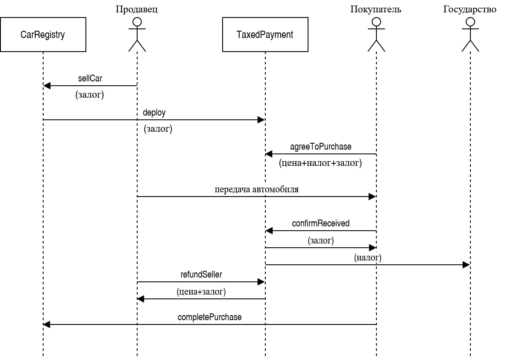

# My Selling Car Whitepaper

## Введение

My selling car это децентрализованная система регистрации, учёта и продажи автомобилей на основе блокчейна, которая призвана упростить отслеживание состояния автомобилей для владельцев, производителей, сервисов обслуживания и государства. Основная цель данной системы - вести учет изменений, связанных с автомобилем, чтобы его история и состояние оставались прозрачными, что является особенно важным на вторичном рынке. При разработке данной системы основополагающим принципом был следующий: право собственности и интересы в отношении всех данных должны принадлежать поставщику данных, в большинстве случаев владельцу автомобиля. Ожидается, что блокчейн и его децентрализованный характер станут идеальным решением для решения поставленных задач.

## Действующие лица и проблемы

В первую очередь необходимо обозначить основных заинтересованных лиц и показать какие проблемы могут быть либо решены, либо упрощены. Выделить можно следующие лица:

1. Владелец (нынешний и потенциальный);
2. Производитель
3. Государство
4. Сервисные центры

Текущий владелец может использовать систему в качестве сервисной книжки, в которой хранятся все изменения, связанные с автомобилем. Обычно у каждого сервисного центра своя база данных, в которой хранится вся информация об автомобилях и произведенных с ними операциях, начиная от подкачки шин, заканчивая полным перебором двигателя. В связи с этим, каждый центр может иметь свою структуру данных для представления этих операций, что затрудняет аккумулирование и обработку всех изменений, связанных с автомобилем. Второй проблемой является то, что сбор этих данных затруднен, так как нигде нет учета о посещенных сервисных центрах, кроме, возможно, сервисной книжки автомобиля, которая, как правило, заполняется только у официальных дилеров марки. В случае же закрытия сервисного центра, информация скорее всего будет утеряна безвозвратно.

Потенциальный владелец (сейчас речь идет о покупателе на вторичном рынке) может использовать систему для изучения автомобиля перед покупкой. Полная история изменений не позволит скрыть какие-либо дефекты, которые могут оказаться критичными для функционирования автомобиля, или недочеты, которые могут быть важны для покупателя. Также учет позволяет защититься от мошенничества, в частности от продажи автомобиля не его владельцем или намеренное искажение характеристик автомобиля, как частный пример, скрутка пробега.

Для производителя система может решить проблемы юридического и финансового характера. Например, фиксация установленных деталей и их оригинальность может помочь регулировать юридические вопросы ответственности в случае, если авто не функционально или имеет дефект производства. При покупке будущий владелец может удостовериться, что все данные об авто внесены, что также может внести ясность при судебном разбирательстве, так как вся информация имеет временные метки. Помимо юридических проблем, система может помочь повысить эффективность продаж оригинальных деталей. Владелец может быть заинтересован в гарантии, которая распространяется на детали и автомобиль, вне зависимости от места приобретения деталей.

Органы государственной власти с помощью данной системы могут вести учет автомобилей и их владельцев, а также состояния автомобилей. Например, для каждого автомобиля, в зависимости от его мощности, устанавливается своя ставка налогообложения. Если владелец решит модифицировать транспорт так, что мощность его в итоге увеличиться, государство сможет сразу же изменить ставку в большую сторону. Помимо состояния, система учитывает продажи всех экземпляров автомобилей, что упрощает учет налогов при продаже или перепродаже автомобиля.

На первый взгляд, сервисные центры в данной системе ничего не выигрывают, а лишь получают для себя дополнительную нагрузку. Однако можно привести некоторые положительные стороны внедрения у них такой системы. Во-первых, поддерживая работу системы сервисный центр однозначно выходит из серой экономической зоны, что позволяет избежать санкций со стороны государства. Во-вторых, учет производимых операций также может упростить регулирование юридических споров, так как можно отследить какой сервис, когда и с какими частями автомобиля работал, что позволяет однозначно определить сервисы, которые могут быть виноваты в неисправности авто. Помимо этого, государство может стимулировать сервисные центры к участию в этой системе различными льготами или меньшими налогами.

## Архитектура системы

### Общие концепции

Общая идея заключается в том, что существует один контракт `CarRegistry`, которым владеет государство. В нем хранится информация об автомобилях и с помощью него можно производить над ними операции.

Все изменения состояния автомобиля хранятся в записях событий, текущее состояние можно получить из контракта, а характеристики выделены в отдельные файлы во внешнем хранилище.

На рисунке 1 представлена общая архитектура системы:

Если автомобиль подлежит продаже, то контракт автоматически создает новый контракт `TaxedPurchase`, таким образом фиксируется разделение зон ответственности контрактов.

На рисунках 2 и 3 представлены специальные диаграммы, описывающие возможные действия и последовательности действий акторов системы:

Диаграмма последовательности:

### Роли

Основных ролей всего три (не включая государство):

1. Владелец (`CarOwner`).
2. Сервисный центр (`ServiceCenter`).
3. Производитель (`Manufacturer`).

Государство/registry - только одно, владелец контракта. Может назначать другие роли и устанавливать уровень налогов.

Производители - создают автомобили (указывают им начальные регистрационные номера и характеристики), а потом могут их продать.

Сервисные центры - могут получить авто во временное пользование и менять у нее все характеристики, в общем без ограничений, а еще добавлять операции в логи. Пользование временное и сервисный центр не может автомобиль продать за владельца. Владелец может в любой момент ее себе забрать обратно.

Остальные (владельцы, физические лица) - права по умолчанию, могут только оперировать своими собственными автомобилями, и все что могут это увеличить ей пробег, отдать в сервисный центр (и забрать обратно), или кому-нибудь продать. Также могут добавлять операции в логи к своим автомобилям.

### Структуры данных

Система построена на смарт контрактах платформы Ethereum.

Основная структура данных, представляющая автомобиль, содержит:

- Код регистрации,
- Характеристики,
- Пробег,
- Текущий владелец,
- Сервисный центр (если она на обслуживании),
- Предыдущий владелец,
- Предыдущая цена.

Пример структуры данных в виде программного кода (Рисунок 4):

Также в контракте содержится следующая информация (Рисунок 5):

1. Идентификатор следующего автомобиля (счетчик),
2. Map для всех автомобилей по их идентификаторам,
3. Map, с помощью которого можно определить все автомобили у конкретного владельца (вспомогательная функция),
4. Map, с помощью которого можно определить, существует ли запрос на продажу конкретного автомобиля в данный момент,
5. Map, с помощью которого можно определить тип налогообложения у владельца автомобиля (по умолчанию считается физическим лицом, с подоходным налогом в 13%).

Кроме структур данных в контракте описаны различные события (Рисунок 6), которые сохраняются в логах.

События тоже записываются в блокчейн. В результате можно, например, просмотреть все события, которые касаются конкретного интересующего автомобиля.

#### Характеристики

Ввиду того, что характеристик у автомобиля много и для разных автомобилей их множество может отличаться, все они выносятся в отдельный файл. Файл представляется в JSON формате и имеет строгую структуру, что позволяет унифицировать алгоритмы обработки этих файлов.

В структуре данных хранится только хэш файла, который в свою очередь является его же названием в отдельном хранилище типа S3. При записи в файл считается его хэш, который берется в качестве ключа в базе данных. Этот хэш и записывается в блокчейне. Это гарантирует, что любой может легко идентифицировать факт, что файл был отредактирован, потому что хэши не будут совпадать (также легко написать программу, которая будет это проверять в автоматическом режиме). Такое решение было принято ввиду того, что полный файл хранить в блокчейне финансово затратно, в то же время хэша достаточно для проверки целостности.

### Налогообложение

Для этого выделен отдельный контракт (Рисунок 7): `TaxedPurchase`.

В нем хранятся данные о продаже конкретного автомобиля, а именно:

- Стоимость (цена),
- Налог при продаже,
- Залог (при продаже обе стороны должны положить в контракт определенную сумму для того, чтобы у них был стимул продажу завершить),
- Продавец,
- Покупатель,
- Лицо, взимающее налог (государство),
- Флаг, показывающий тип платежа (может быть внутренним - полностью оплачиваться валютой платформы, или внешним - через какой-то другой канал),
- Текущее состояние продажи.

## Обзор аналогичных систем

Систем для ведения учета и хранения информации об автомобилях, построенных на основе блокчейн-технологий довольно много. Они предоставляют обширный список возможностей, однако среди них можно выделить класс наиболее часто реализуемых – хранение информации об авто, которая будет полезна при анализе в рамках рынка подержанных автомобилей. Рассмотрим несколько популярных решений в рамках тематики, схожей с предлагаемым решением.

### CarVertical

CarVertical - это блокчейн-платформа международного масштаба, которая фокусируется на создании децентрализованной базы данных для проверки истории транспортных средств. Проект направлен на решение проблем, связанных с мошенничеством на рынке подержанных автомобилей, таких как скрученные пробеги, сокрытие аварий и поддельные документы. Решение использует блокчейн Etherium и основные возможности реализованы на основе смарт-контрактов. Платформа доступна через веб-интерфейс и мобильное приложение, что упрощает взаимодействие с ней.

Система собирает данные о транспортных средствах из следующих источников: национальные реестры, страховые компании, сервисы ТО, платформы продажи автомобилей. Отчеты, формируемые системой, содержат информацию об авариях с участием интересующего транспорта, показания одометра, историю владения и информацию о правовых ограничениях. Все передаваемые в блокчейн данные верифицируются с использованием алгоритмов анализа и сравнения. После записи информации, она не подлежит изменению или удалению третьими лицами. Для формирования отчета по транспортному средству пользователю необходим только его VIN-код.

CarVertical монетизирует свои услуги через продажу отчетов и партнерство с компаниями в сфере автострахования, дилерскими сетями и сервисами ТО. Для расчетов внутри экосистемы используется токен cVToken.

Среди недостатков системы можно выделить ограниченность предоставляемых некоторыми государствами данных, что может сказаться на детализированности и общей полезности отчета для пользователя. Также, система не может создать отчет по прочим данным – ей необходим исключительно VIN-код, который, в ряде случаев, пользователь знать не может.

### VinChain

VinChain — это международная блокчейн-платформа, разработанная для обеспечения прозрачности и достоверности информации о транспортных средствах. Проект стремится решить проблемы подделки данных о пробеге, авариях и других характеристиках автомобиля, предоставляя пользователям надежную и неизменную базу данных, основанную на децентрализованной технологии. Платформа доступна через веб-интерфейс и предоставляет API для интеграции партнеров. Система построена на основе частного блокчейна.

Источниками данных, как и для CarVertical, выступают национальные реестры, страховые компании, автосервисы, платформы продажи автомобилей. Отчеты, формируемые системой на основе данных, хранящихся в блокчейне, содержат историю аварий с участием интересующего автомобиля, его пробег, список владельцев, общую информацию о состоянии и информацию о правовых ограничениях. Передаваемая в блокчейн информация не подлежит изменению или удалению. Отчет формируется по VIN-коду транспортного средства.

Монетизация данных решения основана на выплате вознаграждения поставщику данных о транспортном средстве и назначением стоимости отчета, которую пользователь должен возместить. Для расчетов внутри системы используется токен VIN.

Недостатки системы повторяют недостатки CarVertical – ограниченность предоставляемых некоторыми государствами данных и необходимость знать VIN-код транспортного средства, по которому производится формирование отчета.

### Gapless

Gapless — это цифровая платформа, которая позволяет владельцам автомобилей управлять полной историей транспортного средства в едином приложении. Платформа использует технологию блокчейн для обеспечения прозрачности, безопасности и неизменности данных. Gapless ориентирована на предоставление достоверной информации о транспортных средствах для их владельцев, покупателей и других участников автомобильной экосистемы. Взаимодействие с системой осуществляется с помощью мобильного приложения и веб-интерфейса. Также реализован API для интеграции с внешними сервисами. Реализация решения основана на Etherium и смарт-контрактах.

В качестве источника данных система использует государственные базы данных, базы данных производителей авто, данные сервисных и дилерских центров, а также данные владельцев.
Данные отчета, формируемого решением, аналогичны системам, приведенным выше, однако для идентификации транспортного средства может использоваться больше данных, а не только VIN-код.

В будущем платформа планирует предоставлять владельцам возможность монетизации данных автомобиля, например, предоставляя доступ к информации страховым компаниям или исследовательским организациям. На данный момент, основные способы монетизации заключаются в продаже отчетов и предоставления платной подписки на премиум-функции, а также в предоставлении аналитических данных (на уровне рынка) для заинтересованных компаний и организаций.

### Сравнение с My Selling Car

Если сравнивать представленное решение с рассмотренными выше в разрезе предоставляемых возможностей, то следует выделить ориентированность на оптимизацию процессов, связанных с государственным регулированием сферы. Расчет налоговой ставки внутри системы и фиксация всех изменений в конфигурации автомобиля могли бы сократить издержки бюджетных средств, поскольку вся эта информация собрана в одном месте, информация не изменяема, а комплексная поддержка инфраструктуры не требуется, что ведет к сокращению расходов. К тому же, как было отмечено ранее, для всех стейкхолдеров упрощается решение множества часто возникающих юридических вопросов, что, пусть и менее значительно, но тоже способствует оптимизации процессов государственного регулирования. Потенциально, система может стать еще полезнее для государства. Например, интеграция с современными системами управления автомобилей могла бы позволить фиксировать данные о передвижении и маршрутах, что даст возможность собирать набор данных для исследования транспортных потоков.

С точки зрения предоставляемых данных об автомобиле, рассмотренные решения и My Selling Car можно назвать схожими, поскольку информация о состоянии автомобиля фиксируется в JSON-файле, состав полей и формат значений которого не регулируются, что дает возможность не привязываться к конкретной структуре описания состояния.

В части взаимодействия пользователей с системой, рассмотренные платформы более удобны за счет наличия веб-интерфейсов и мобильных приложений. Также, My Selling Car не предоставляет возможности удобной интеграции для потенциальных партнеров.

## Заключение

Представлена система регистрации, учета и продажи автомобилей на основе блокчейн-технологий My Selling Car. Система позволяет вести учет изменений конфигурации автомобиля для предоставления прозрачной истории его состояния. Решение может стать интересным как для владельцев, так и для других сторон – потенциального покупателя, государства, производителя и представителей сервисных центров. Также, были рассмотрены существующие решения с целью их описания и сравнения с My Selling Car в разрезе ключевых возможностей и общего ориентирования.
